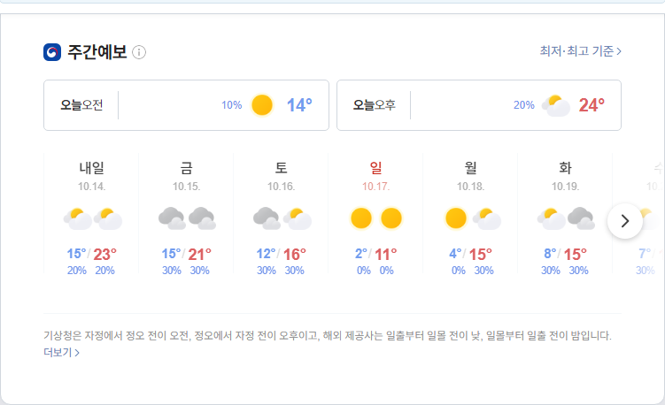

##  2020-09-08 15:31:56   화요일 
##### 날씨   -   어제보다 6 ° 높아요

----
----

##### 지수

| 종목 | 현재가 | 등락(전일비) | BUY | SELL | . |
|-|-|-|-|-|-|
|코스피|2,402.26|+18.04  /  +0.76%|2,000|3,000|0|

----

### 테스트 1

| 종목 | 현재가 | 등락(전일비) | BUY | SELL | . |
|-|-|-|-|-|-|
|코스피|2,402.26|+18.04  /  +0.76%|2,000|3,000|0|

----

### 테스트 2

| 종목 | 현재가 | 등락(전일비) | BUY | SELL | . |
|-|-|-|-|-|-|
|코스피|2,402.26|+18.04  /  +0.76%|2,000|3,000|0|
|코스피|2,402.26|+18.04  /  +0.76%|2,000|3,000|0|
|코스피|2,402.26|+18.04  /  +0.76%|2,000|3,000|0|
|코스피|2,402.26|+18.04  /  +0.76%|2,000|3,000|0|
|코스피|2,402.26|+18.04  /  +0.76%|2,000|3,000|0|
|코스피|2,402.26|+18.04  /  +0.76%|2,000|3,000|0|
|코스피|2,402.26|+18.04  /  +0.76%|2,000|3,000|0|
|코스피|2,402.26|+18.04  /  +0.76%|2,000|3,000|0|
|코스피|2,402.26|+18.04  /  +0.76%|2,000|3,000|0|
|코스피|2,402.26|+18.04  /  +0.76%|2,000|3,000|0|
|코스피|2,402.26|+18.04  /  +0.76%|2,000|3,000|0|
|코스피|2,402.26|+18.04  /  +0.76%|2,000|3,000|0|
|코스피|2,402.26|+18.04  /  +0.76%|2,000|3,000|0|
|코스피|2,402.26|+18.04  /  +0.76%|2,000|3,000|0|
|코스피|2,402.26|+18.04  /  +0.76%|2,000|3,000|0|
|코스피|2,402.26|+18.04  /  +0.76%|2,000|3,000|0|
|한국전력|20,500|-150  /  -0.73%|25,776|30,000|10|
|삼성엔지니어링|11,350|-100  /  -0.87%|11,350|12,000|9|
|CJ CGV|23,500|-150  /  -0.63%|34,961|36,000|48|
|아모레퍼시픽|170,000|=0  /  =0.00%|235,834|240,000|20|
|한화|20,500|-150  /  -0.73%|25,630|0|1|
|NAVER|11,350|-100  /  -0.87%|148,046|400,000|1|
|LG화학우|23,500|-150  /  -0.63%|203,474|500,000|1|
|스튜디오드래곤|170,000|=0  /  =0.00%|82,300|100,000|5|
|글로벌럭셔리|170,000|=0  /  =0.00%|9,630|15,000|1|
|QV미국IT|170,000|=0  /  =0.00%|24,100|30,000|1|
|호텔신라|20,500|-150  /  -0.73%|73,008|100,000|5|
|S-Oil|11,350|-100  /  -0.87%|62,996|100,000|3|
|LG전자|23,500|-150  /  -0.63%|82,255|100,000|58|
|지역난방공사|170,000|=0  /  =0.00%|34,200|60,000|20|
|한화|20,500|-150  /  -0.73%|25,288|0|50|
|삼성전자우|11,350|-100  /  -0.87%|48,370|0|1|
|한화에어로스페이스|23,500|-150  /  -0.63%|25,779|0|30|
|한국금융지주|170,000|=0  /  =0.00%|62,123|0|5|
|글로벌럭셔리|170,000|=0  /  =0.00%|12,850|0|1|

----

### 테스트 3

| 종목 | 현재가 | 등락(전일비) | BUY | SELL | . |
|-|-|-|-|-|-|
|코스피|2,402.26|+18.04  /  +0.76%|2,000|3,000|0|