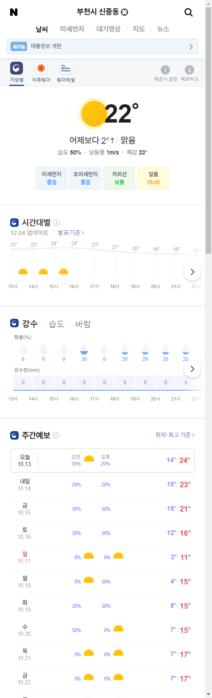

# wpgnsl.github.io
jason daily report blog

## 2020.xx.xx (요일)

##### 날씨
<!--  -->

<!-- 

 -->

----

##### 주가
<!-- | 종목 | 현재가 | 등락율(전일대비) | 구매가 | 목표가 | 목표율 % |
|-|-|-|-|-|-|
|삼성전자|1,000,000|+3.04%(1,500)|1,000,000|1,000,000|89%|
|삼성전자|1,000,000|+3.04%(1,500)|1,000,000|1,000,000|89%|
|삼성전자|1,000,000|+3.04%(1,500)|1,000,000|1,000,000|89%|
|삼성전자|1,000,000|+3.04%(1,500)|1,000,000|1,000,000|89%| -->

| 종목 | 현재가 | 등락율(전일대비) | 구매가 | 목표가 | 목표율 % | 앙 | 되 |
|-|-|-|-|-|-|-|-|
|삼성전자|1,000,000|+3.04%(1,500)|1,000,000|1,000,000|89%|
|삼성전자|1,000,000|+3.04%(1,500)|1,000,000|1,000,000|89%|
|삼성전자|1,000,000|+3.04%(1,500)|1,000,000|1,000,000|89%|
|삼성전자|1,000,000|+3.04%(1,500)|1,000,000|1,000,000|89%| 

<!-- |금|1,000,000|+3.04%(1,500)|-|1,000|89%|-|-|
|WTI|1,200|+3.04%(1,500)|-|1,000|30%|-|-|
|달러|1,200|+3.04%(1,500)|-|1,000|30%|-|-| -->

----

##### 해외
<!-- | 종목 | 지수 | 등락율(전일대비) | - | 목표가 | 목표율 % |
|-|-|-|-|-|-|
|다우|18,400.00|+1.04%(1,500)|-|-|-| -->
<!-- |나스닥|18,400.00|+1.04%(1,500)|-|-|-|
|상해종합|18,400.00|+1.04%(1,500)|-|-|-|
|인도|18,400.00|+1.04%(1,500)|-|-|-|
|베트남|18,400.00|+1.04%(1,500)|-|-|-| -->

| 종목 | 현재가 | 등락율(전일대비) | 구매가 | 목표가 | 목표율 % |
|-|-|-|-|-|-|
|금|1,000,000|+3.04%(1,500)|-|1,000|89%|
|WTI|1,200|+3.04%(1,500)|-|1,000|30%|
|달러|1,200|+3.04%(1,500)|-|1,000|30%|

----

##### 지표

| 종목 | 현재가 | 등락율(전일대비) | 구매가 | 목표가 | 목표율 % |
|-|-|-|-|-|-|
|금|1,000,000|+3.04%(1,500)|-|1,000|89%|
|WTI|1,200|+3.04%(1,500)|-|1,000|30%|
|달러|1,200|+3.04%(1,500)|-|1,000|30%|

----
